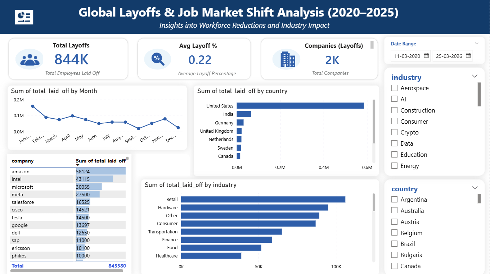
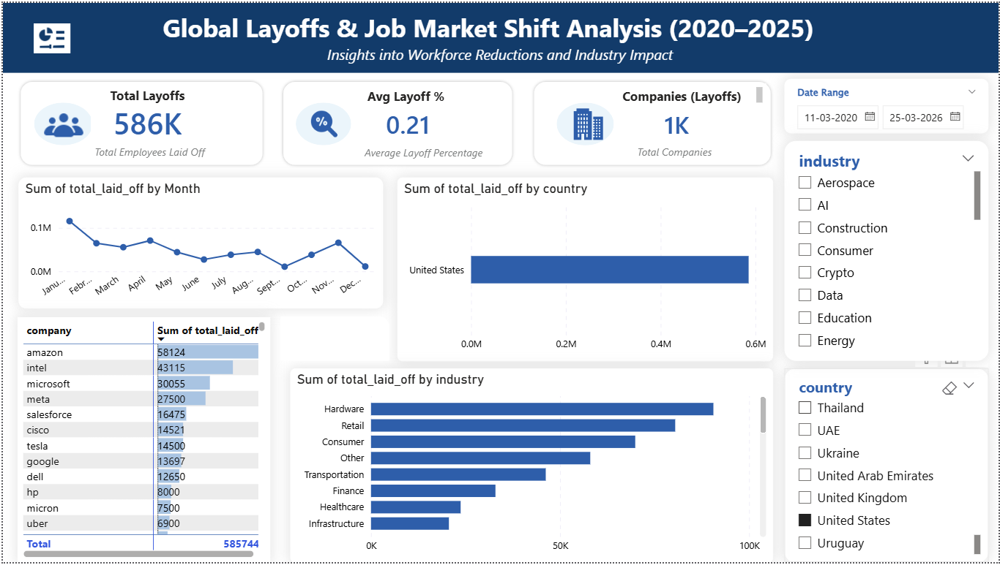
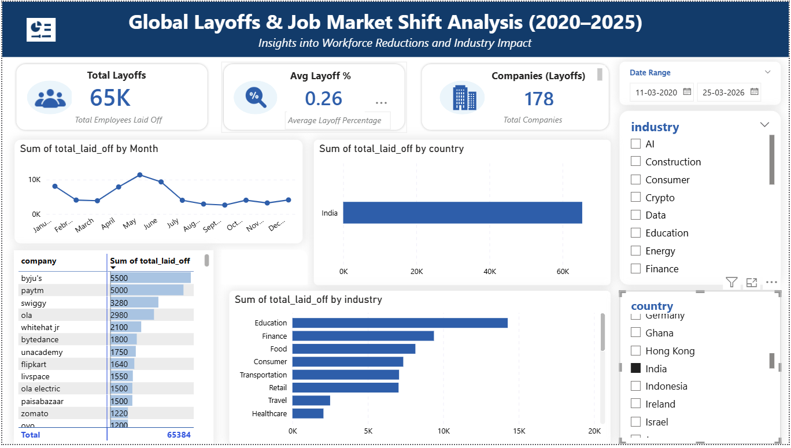
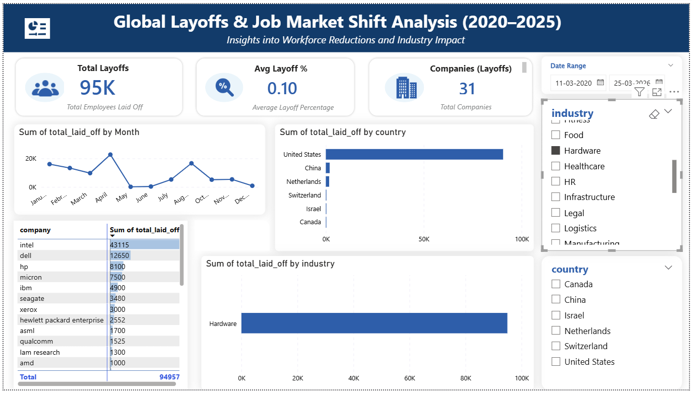

# 🌍 Global Layoffs & Job Market Shift Analysis (2020–2025)

## 📌 Project Overview

This Power BI project analyzes global layoff trends from **2020 to 2025** across countries, industries, and companies. The objective was to transform raw layoff data into actionable insights using interactive dashboards, KPI cards, trend visuals, and slicers.

The dashboard helps understand:

- Which countries were most affected
- Which industries faced the highest layoffs
- Which companies conducted the largest workforce reductions
- How layoffs changed over time
- Country-specific and sector-specific trends

---

## 🎯 Business Objective

Organizations, recruiters, job seekers, and analysts can use this dashboard to understand workforce restructuring trends and identify shifts in the global job market.

---

## 🛠️ Tools & Technologies Used

- **Power BI**
- **Power Query** (Data Cleaning & Transformation)
- **DAX** (KPIs & Measures)
- **Excel / CSV Dataset**
- **GitHub**

---

## 📊 Dashboard Features

- KPI Cards
- Country-wise Layoff Analysis
- Industry-wise Impact Analysis
- Company-wise Layoff Ranking
- Monthly Layoff Trend Analysis
- Date Range Filters
- Country & Industry Slicers
- Interactive Drill-down Insights

---

## 📈 Key KPIs

| KPI | Value |
|-----|------|
| Total Layoffs | 844K |
| Avg Layoff % | 22% |
| Countries Analyzed | Multiple |
| Companies with Layoffs | 2K+ |

---

# 🔍 Key Insights

## 1️⃣ Global Workforce Reduction

A total of **844K layoffs** were recorded in the dataset, indicating significant workforce restructuring globally between 2020 and 2025.

---

## 2️⃣ United States Had the Highest Layoffs

The **United States** recorded the highest layoffs at approximately **586K**, contributing the majority share of total layoffs.

### Top impacted companies from the US:

- Amazon  
- Intel  
- Microsoft  
- Meta  

This indicates large-scale restructuring among major market leaders.

---

## 3️⃣ India Ranked Second

**India** ranked second with approximately **65K layoffs**, making it the next most impacted country after the United States.

### Top impacted sector in India:

- **Education**

This suggests pressure in EdTech and digital learning businesses.

---

## 4️⃣ Layoffs Were Concentrated in Few Countries

After the top two countries, several other top countries recorded layoffs near the **20K range**, showing that layoffs were concentrated in a limited number of economies.

---

## 5️⃣ Most Impacted Industries Globally

The industries with the highest layoffs were:

- Retail  
- Hardware  
- Consumer  
- Finance  

This shows that layoffs were not limited to software companies alone.

---

## 6️⃣ Layoff Trends Happened in Waves

Monthly trend analysis shows layoffs occurred in cycles rather than uniformly, reflecting changing economic and business conditions over time.

---

# 💼 Business Interpretation

The findings suggest that many organizations likely adjusted workforce size due to:

- Cost optimization initiatives  
- Post-expansion hiring corrections  
- Economic slowdown concerns  
- Industry demand shifts  
- Strategic restructuring  

---

# 📷 Dashboard Preview

> Add your dashboard screenshots here
# 📷 Dashboard Preview

## 🌍 Main Dashboard Overview

## USA Country Filter View (United States)

## INDIA Country Filter View (India)

## 📊 Industry & Company Analysis

